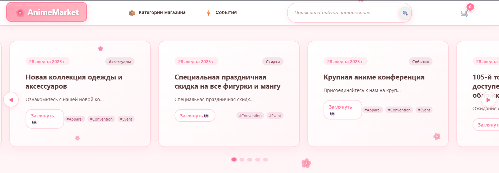
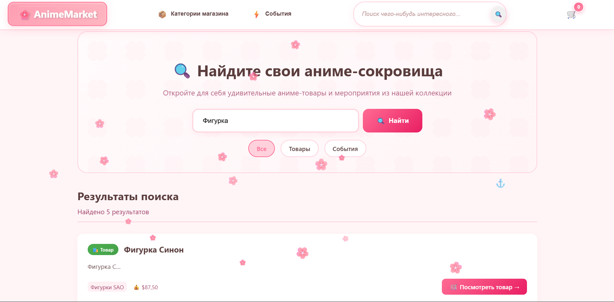
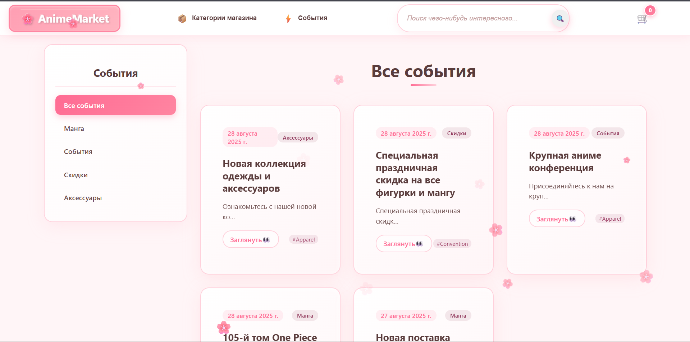
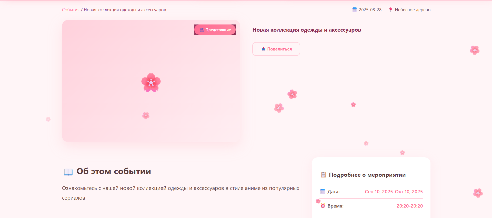
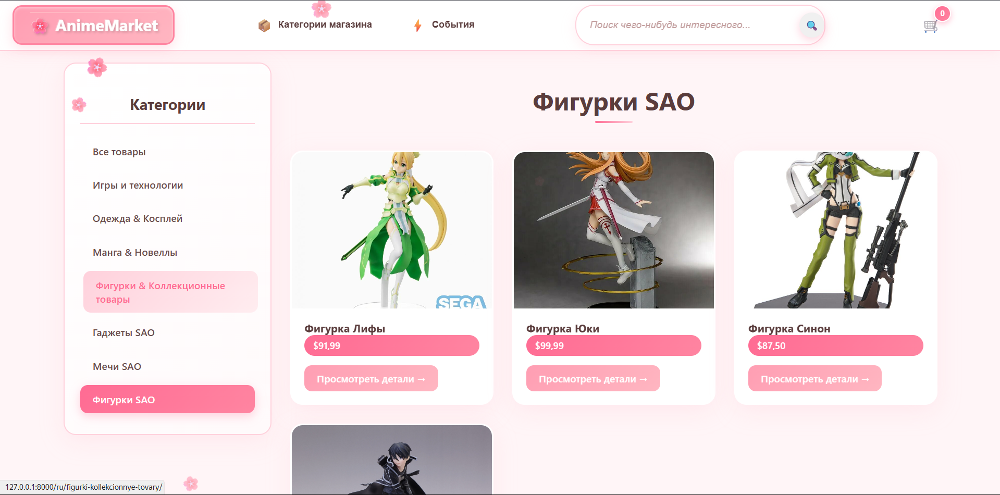
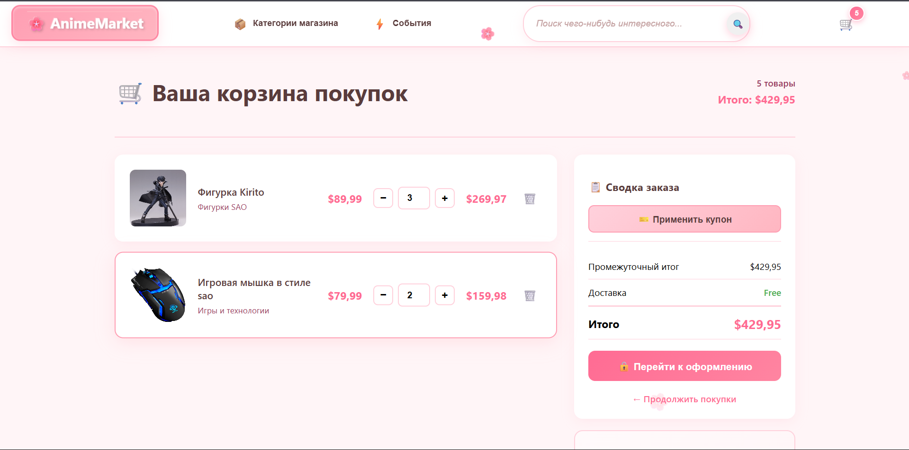
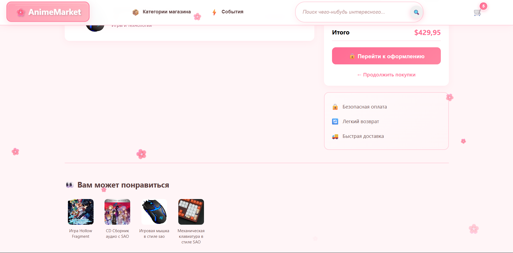
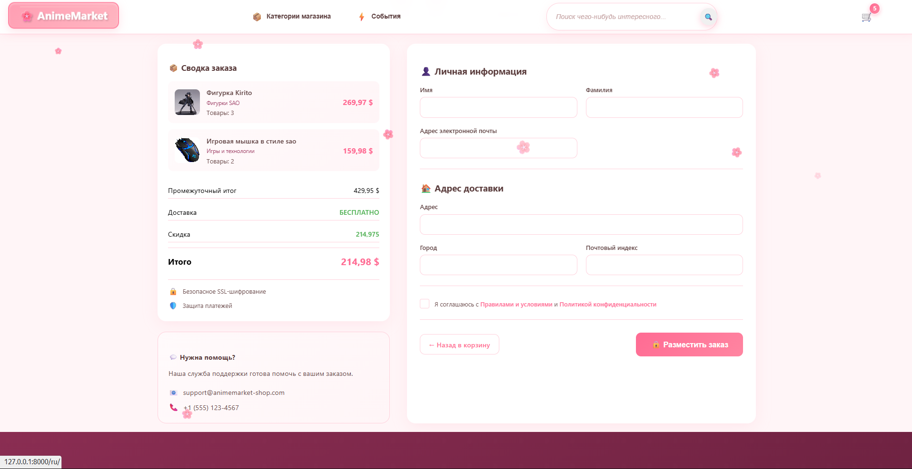
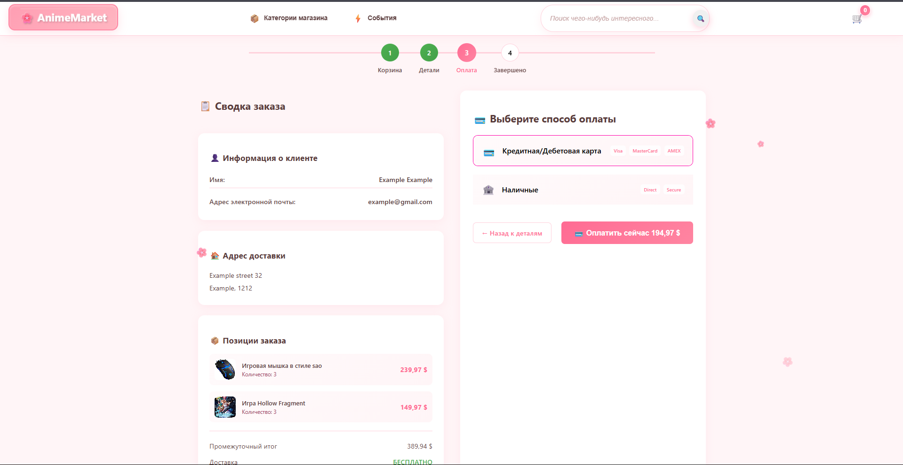
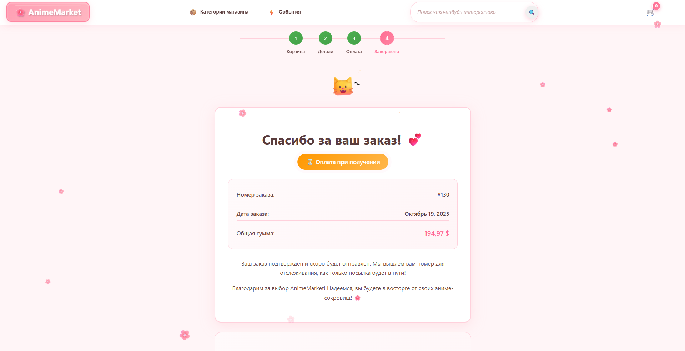

# 🌸 Anime Store — Аниме Магазин

Онлайн-магазин в стиле японской эстетики, выполненный в **розовых тонах** с элементами **лепестков сакуры 🌸**, создающими атмосферу уюта и гармонии.  
Сайт поддерживает **два языка** — 🇷🇺 **Русский** и 🇬🇧 **Английский**.

---

## 🧩 Используемые технологии

- **Django** — фреймворк для серверной части сайта  
- **Django Translation Framework** — встроенный механизм перевода сайта  
- **Taggit** — система тегов для товаров и событий  
- **Redis** — реализация системы рекомендаций (товары, покупаемые вместе)  
- **Stripe** — платёжный шлюз для оплаты банковскими картами  
- **Rosetta** — веб-интерфейс для управления переводами  
- **JavaScript** — используется для отображения интерактивной карты  

---

## 🏠 Главная страница

На главной странице представлена лента новостей, категории товаров и поисковая строка.

### 🎉 Лента событий и акций
Отображает последние новости, акции и события магазина.  


### 🛍️ Категории товаров
Показывает основные категории товаров, представленные в магазине.  


### 🔎 Поиск по сайту
Реализован поиск товаров и событий через шапку сайта, работающий **на двух языках**.  


---

## 🔍 Страница поиска

Поиск по товарам и событиям с поддержкой **русского и английского языков**.  


---

## 📰 Лента событий

Здесь отображаются все текущие **новости и события** сообщества магазина.  
Доступен выбор категории и реализована **постраничная разбивка**.  


---

## 🗺️ Карточка события

Карточка события содержит:
- Информацию о месте проведения (с интерактивной картой)  
- Дату и время проведения  
- Рекомендации на основе тегов  



---

## 🛒 Список товаров

Страница списка товаров содержит товары разных категорий, с возможностью **фильтрации**.  


---

## 💎 Карточка товара

На карточке товара представлена:
- Полная информация о товаре  
- Стоимость и описание  
- **Рекомендации товаров**, которые чаще всего покупаются вместе  


---

## 🧺 Корзина

В корзине пользователь может:
- Просмотреть товары  
- Изменить количество  
- Добавить **купон на скидку**  
- Увидеть **рекомендации товаров**, покупаемых вместе  

  


---

## 📝 Оформление заказа

Форма для заполнения основных данных покупателя:
- Имя и фамилия  
- Адрес доставки  
- Электронная почта  



---

## 💳 Выбор способа оплаты

Доступны два способа оплаты:
- 💳 Оплата картой через **Stripe** — переход на страницу оплаты  
- 📦 Оплата при получении — переход на страницу подтверждения заказа  



---

## ✅ Успешный заказ

После оформления отображается статус заказа — **оплачен** или **ожидает оплаты**.  


---

## ⚙️ Запуск проекта на локальной машине

Для корректной работы сайта необходимо выполнить следующие шаги:

1️⃣ **Запуск сервера Django**  
```bash
python manage.py runserver
```

2️⃣ **Запуск базы данных Redis (через Docker)**  
```bash
docker run -it --rm --name redis -p 6379:6379 redis
```

3️⃣ **Запуск платёжного шлюза Stripe (для обработки вебхуков)**  
```bash
stripe.exe listen --forward-to localhost:8000/payment/webhook/
```

---

## 🌸 Особенности проекта

- Эстетика, вдохновлённая японской культурой и лепестками сакуры  
- Поддержка **многоязычности (RU/EN)**  
- Интеллектуальная **рекомендательная система**  
- Гибкая фильтрация и поиск товаров  
- Интеграция с **Stripe**  
- Удобный интерфейс перевода через **Rosetta**

---

## 📜 Лицензия

Проект распространяется под лицензией **MIT**.

---

**Anime Store — воплощение японской эстетики и магии сакуры 🌸**
